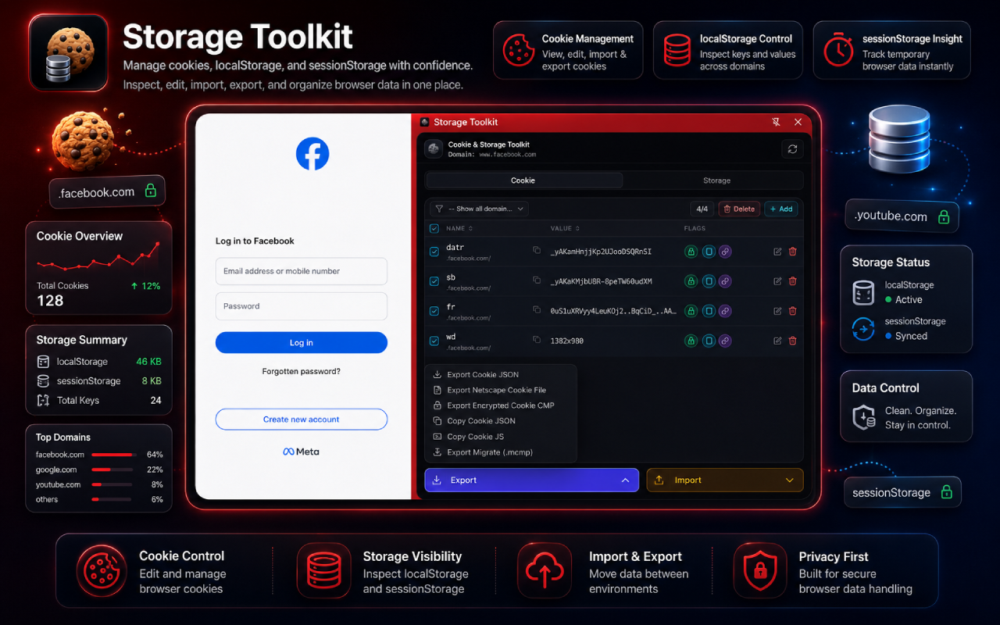
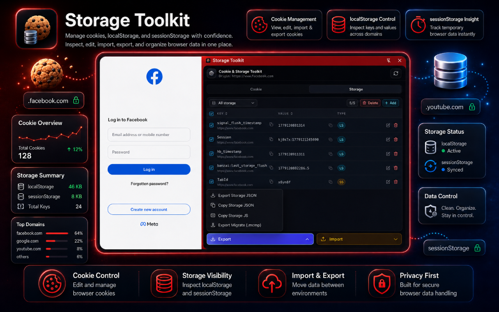

# Cookie & Storage Toolkit

[English](README.md) | [Tiếng Việt](README.vi.md)

Cookie & Storage Toolkit is a browser extension for inspecting, editing, importing, exporting, and migrating cookies, localStorage, and sessionStorage from a compact side panel or sidebar.

## Screenshots





## Purpose

Cookie & Storage Toolkit helps developers, testers, QA teams, and support engineers debug browser state faster. You can inspect the current site's cookies and web storage, edit values, move data between environments, and create clean export files without jumping through browser settings or DevTools panels.

## Main Features

- View cookies for the active tab, including domain, path, value, and security flags.
- View localStorage and sessionStorage for the active tab origin.
- Filter cookies by domain.
- Filter storage items by localStorage or sessionStorage.
- Sort cookies by name or value.
- Sort storage items by key or value.
- Add, edit, and delete cookies or storage items.
- Delete multiple selected cookies or storage items with confirmation.
- Export selected cookies as JSON, Netscape Cookie File, browser-console JavaScript, or encrypted `.cmp` file.
- Import cookies from JSON, Netscape Cookie File text, pasted data, or encrypted `.cmp` file.
- Export selected storage items as JSON or browser-console JavaScript.
- Import storage items from JSON files or pasted JSON data.
- Export and import migration `.mcmp` files containing both cookies and storage items for the current site.
- Copy cookie names, storage keys, and values directly from rows.
- Use Chrome Side Panel and Firefox Sidebar builds.

## Requirements

- Node.js.
- Chrome or a Chromium-based browser that supports Manifest V3 and Side Panel.
- Firefox, if you want to build the Firefox version.

This repository does not require any extra npm packages to build the extension.

## Build

Build the Chrome version:

```sh
node scripts/build-extension.js chrome
```

The output is created at:

```text
dist/chrome
```

Build the Firefox version:

```sh
node scripts/build-extension.js firefox
```

The output is created at:

```text
dist/firefox
```

Build and create store upload zip files:

```sh
node scripts/build-extension.js chrome zip
node scripts/build-extension.js firefox zip
```

The zip files are created at:

```text
dist/chrome-v2.0.zip
dist/firefox-v2.0.zip
```

The zip file names use the current manifest version. The build script removes older zip files for the same target and creates clean store upload files without macOS hidden files such as `.DS_Store`, `._*`, or `__MACOSX`.

## Install Unpacked On Chrome

1. Build the Chrome version:

```sh
node scripts/build-extension.js chrome
```

2. Open Chrome and go to:

```text
chrome://extensions
```

3. Enable **Developer mode**.
4. Click **Load unpacked**.
5. Select this folder:

```text
dist/chrome
```

6. After installation, click the Cookie & Storage Toolkit icon on the toolbar to open the extension in the Side Panel.

## Temporary Installation On Firefox

1. Build the Firefox version:

```sh
node scripts/build-extension.js firefox
```

2. Open Firefox and go to:

```text
about:debugging#/runtime/this-firefox
```

3. Click **Load Temporary Add-on...**.
4. Select this file:

```text
dist/firefox/manifest.json
```

5. After installation, open Cookie & Storage Toolkit from the Firefox toolbar or sidebar.

Note: Temporary Firefox add-ons are removed when the browser closes. Load the add-on again if you want to continue testing.

## Build Structure

- `manifest.chrome.json`: manifest used for the Chrome build.
- `manifest.firefox.json`: manifest used for the Firefox build.
- `src/background`: background script used to open the Side Panel or Sidebar.
- `src/sidepanel`: cookie, localStorage, and sessionStorage management UI.
- `src/assets`: extension icons and logo.
- `scripts/build-extension.js`: packages the extension into `dist/chrome` or `dist/firefox`.
- Add the `zip` or `--zip` argument to create a clean versioned store upload zip file in `dist`.

## Author

- Author: [Hadesker](https://hadesker.dev)
- Email: hello@hadesker.net

## License

This project is released under the MIT License. See [LICENSE](LICENSE) for details.
